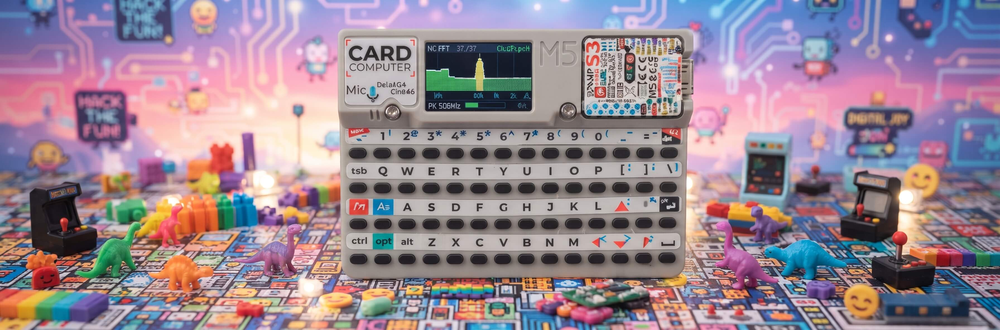

# AUDIO SPECTRUM — M5Stack Cardputer

[](https://docs.micropython.org/)
[](https://aiflow.m5stack.com/)
[](https://docs.m5stack.com/en/device/Cardputer)
[](LICENSE)

<p align="center"></p>

A real‑time audio frequency spectrum analyzer for the **M5Stack Cardputer** running MicroPython / UIFlow2. It captures live audio from the built‑in PDM microphone, computes an FFT, and renders a 40‑band logarithmic spectrum display with peak‑hold and RMS meter on the 1.28″ OLED screen.

---

## Features

- 🎵 Real‑time 40‑band logarithmic spectrum (60 Hz – 4 kHz)
- 📊 Peak‑hold markers with configurable decay rate
- 📉 RMS level meter with auto‑scaled dB range
- 🔍 Automatic microphone self‑check on boot (4 pin configurations tested)
- 📉 Pure MicroPython FFT (iterative radix‑2, no external libraries)
- 🎨 Dark‑themed terminal‑style UI with color‑coded bars (green → yellow → red)
- 📟 Frequency scale labels at 100 / 500 / 1k / 2k / 4k Hz
- 🔄 Auto‑recovery: rescans mic if audio is lost mid‑run

---

## Architecture

```
┌───────────────────────────────────────────────────┐
│                    main.py                        │
│  ┌───────────┐ ┌───────────────────────────────┐  │
│  │  DISPLAY  │ │         MIC DRIVER            │  │
│  │  (M5.Lcd) │ │   SPM1423  PDM  DAT=G46       │  │
│  │           │ │   CLK=G43 (shared with amp)   │  │
│  └─────┬─────┘ └───────────────┬───────────────┘  │
│        │                       │                  │
│  ┌─────▼───────────────────────▼───────────────┐  │
│  │              CAPTURE / DECODE               │  │
│  │   blocking Mic.record() → BUF → RAW[]       │  │
│  └───────────────────────┬─────────────────────┘  │
│                          │                        │
│  ┌───────────────────────▼─────────────────────┐  │
│  │               FFT ENGINE                    │  │
│  │   iterative radix‑2 · 256 points            │  │
│  │   Hann window · 31.25 Hz/bin                │  │
│  └───────────────────────┬─────────────────────┘  │
│                          │                        │
│  ┌───────────────────────▼─────────────────────┐  │
│  │            SPECTRUM ANALYSIS                │  │
│  │   40‑band log mapping · peak‑hold · RMS     │  │
│  └───────────────────────┬─────────────────────┘  │
│                          │                        │
│  ┌───────────────────────▼─────────────────────┐  │
│  │              DRAWING LOOP                   │  │
│  │   spectrum bars · grid · peak markers       │  │
│  │   frequency axis · PK Hz · RMS meter        │  │
│  └─────────────────────────────────────────────┘  │
│                                                   │
│  ┌─────────────────────────────────────────────┐  │
│  │          MIC SELF‑CHECK (setup)             │  │
│  │ tries os=1/4 × park=yes/no → locks variant  │  │
│  └─────────────────────────────────────────────┘  │
└───────────────────────────────────────────────────┘
```

---

## Project Structure

```
M5Cardputer-Audio-Spectrum/
├── src/
│   └── main.py          # Complete application (~700 lines)
├── docs/
│   └── banner.jpg       # Screenshot / banner image
└── README.md
```

---

## Hardware Requirements

- **M5Stack Cardputer** (ESP32‑S3, 240×135 OLED, built‑in keyboard)
- Firmware must include **M5**, **machine**, and **time** modules (standard in UIFlow2 Cardputer images)

> **Note:** The amplifier (NS4168) shares pin **G43** with the mic clock. The app tears down the speaker driver before every `Mic.begin()` to avoid pin conflicts. A speaker‑less boot is required for correct initialization.

---

## How to Flash

### Prerequisites

1. Install [UIFlow2](https://aiflow.m5stack.com/) and connect your Cardputer via USB.
2. In UIFlow2, select **M5Stack‑Cardputer** as the device and create a **blank project**.

### Step 1 — Open the project in Code mode

1. Click the **Code** tab in UIFlow2 to switch to Python editing.
2. Copy the entire contents of `src/main.py`.
3. Paste it into the editor, replacing any existing code.

### Step 2 — Flash to the device

1. Click the **Flash** button to write the program to the Cardputer.

### Step 3 — First run

After flashing, the Cardputer will:
1. Run a **MIC SELF CHECK**, trying four pin configurations.
2. Lock onto the working variant (displayed in the header as `OK os1` or `OK os4`).
3. Show the spectrum display ready to capture audio.

> **Tip:** Speak, clap, or play music near the Cardputer's built‑in microphone to see the bars animate.

---

## Display Layout

```
┌────────────────────────────────────────────────────┐
│  MIC FFT           8k/256               OK os1+    │  ← Header
├────────────────────────────────────────────────────┤
│  ▌▊▋▌▎▍▌▊▋▌▎▍▌▊▋▎▍▌▊▋▌▎▍▌▊▋▌▎▎▍▍ │
│  ├────────┼───────────┼──────────────┼───────────┤ │  ← Spectrum
│  100     500          1k            2k        4k Hz│  ← Scale
├────────────────────────────────────────────────────┤
│  PK  1247Hz             ▓▓▓▓▓▓░░░░    18f/s        │  ← Info
└────────────────────────────────────────────────────┘
```

| Area | Content |
|------|---------|
| **Header** | Title, sample rate, locked mic variant |
| **Spectrum** | 40‑bar log‑scale FFT display (60 Hz – 4 kHz) |
| **Scale** | Frequency markers at 100 / 500 / 1k / 2k / 4k Hz |
| **PK** | Peak frequency in Hz |
| **RMS Meter** | Level bar + frames/sec counter |

---

## Technical Details

| Parameter | Value |
|-----------|-------|
| Sample rate | 8 kHz |
| FFT size | 256 points (32 ms window) |
| Resolution | 31.25 Hz per bin |
| Displayed range | 60 Hz – 4 kHz (logarithmic) |
| Bars | 40 (log‑spaced) |
| Peak decay | 45 dB/s |
| Gate threshold | −78 dB |
| Dynamic range | 55 dB |

### Mic Pinout (K132 / K132‑V11)

| Signal | Pin | IC |
|--------|-----|----|
| DATA | G46 | SPM1423 (PDM) |
| CLK | G43 | SPM1423 / NS4168 (shared) |

### Configuration Search Order

The self‑check tries these four variants in order:

| # | over_sampling | park pin |
|---|---------------|----------|
| 1 | 1 | No |
| 2 | 4 | No |
| 3 | 1 | Yes |
| 4 | 4 | Yes |

The first variant that produces two consecutive "live" blocks is locked.

---

## Troubleshooting

| Symptom | Possible cause |
|---------|----------------|
| Header shows `MIC NOT AVAILABLE` | G43 is owned by another driver; reboot with nothing else using the pin |
| All bars flat / no response | Check that you're speaking close to the mic; try clapping |
| `CONST` or `DEBRIS` in search | Pin conflict or loose connection; power cycle and retry |
| Bars saturated (all red) | Gain may be too high; this is normal for loud sounds |
| Flickering or slow update | Try a different `over_sampling` value during search |

---

## License

MIT License. Feel free to fork, modify, and use for your own projects.
